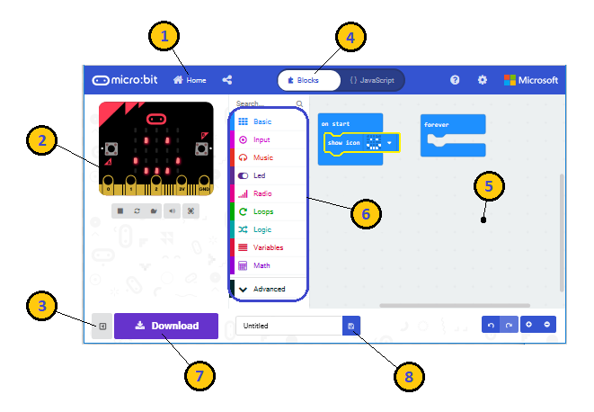
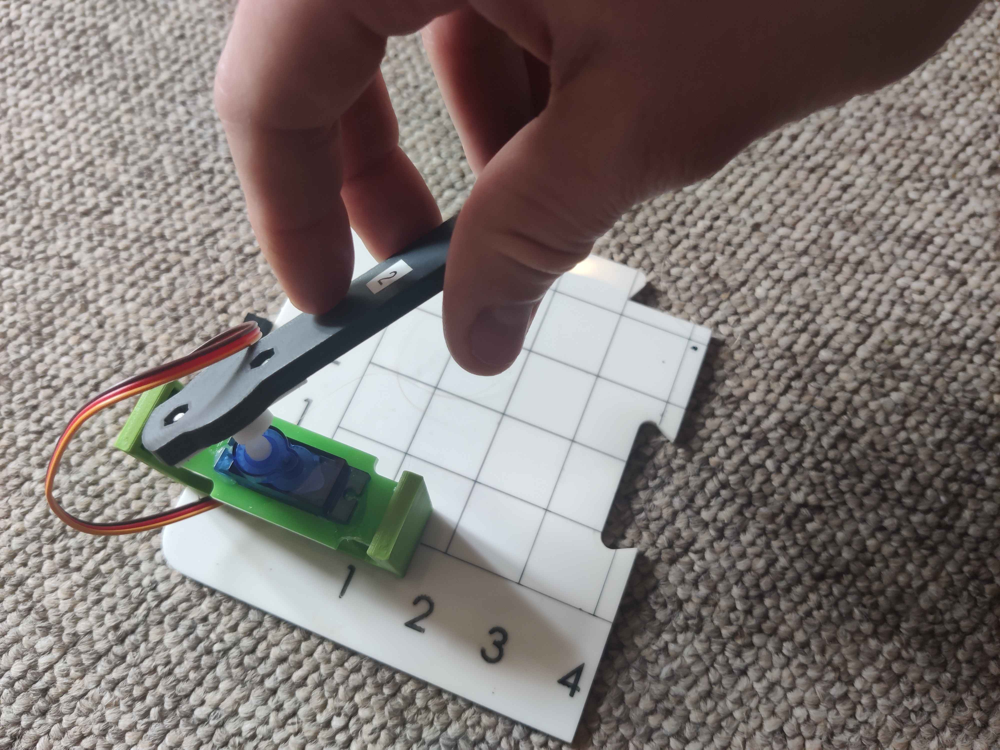

<!--Comment: Above here is the header, we need this to generate the web page-->

<!--Comment: This section is markdown-->

A project activity for [Girls Into Coding](https://www.girlsintocoding.com/)

This session is designed to be fun! The idea is that we can follow it together in a class, but that we can also be free to move at our own pace. We're going to be doing some basic python programming in this activity. You also have the opportunity to use the make code block based programming language. So whatever your level, you have lots of options! 

The idea with this acitivity isn't to become an ACE programmer inside 2 hours, but it's just to get an **appreciation** of programming robots. So that you can use this knowledge for good in the future :)! 

<!--Comment: End of markdown section-->

<!--Comment: This code here is html-->

<!--Comment: This is html paragraph spacing  -->
 

<!--Comment: This is html bootstrap-->

<h2>Contents</h2>
<ul class="list-group">
  <li class="list-group-item"><a href="#Begin">Begin: Check you have the right equipment</a></li>
  <li class="list-group-item"><a href="#Activity1">Activity 1: Let's boot up the microbit and check it is working</a></li>
  <li class="list-group-item"><a href="#Activity2">Activity 2: How do we measure a sound?</a></li>
  <li class="list-group-item"><a href="#Activity3">Activity 3: Let’s assemble our motor</a></li>
  <li class="list-group-item"><a href="#Activity4">Activity 4: Let's make the motor move</a></li>
  <li class="list-group-item"><a href="#Activity5">Activity 5: The definition of angles</a></li>
  <li class="list-group-item"><a href="#Activity6">Activity 6: Creating a volume meter - step 1</a></li>
  <li class="list-group-item"><a href="#Activity7">Activity 7: Creating a volume meter - step 2</a></li>
</ul>

<h2>Resources</h2> 
  
Here's some resources that may help with the activity

<ul class="list-group">
  <a href="https://www.w3schools.com/python/" target="_blank" class="list-group-item list-group-item-action">Python tutorials at W3 Schools</a>
  <a href="https://www.pythoncheatsheet.org/" target="_blank" class="list-group-item list-group-item-action">Python cheatsheet</a>
</ul>

<!--Comment: This is the end of html bootstrap-->

<!--Comment: Paragrpah spacing-->
 
 

<!--Comment: This section is markdown again-->

# Let's begin
---

<!--Comment: End of markdown-->

<!--Comment: Back to html bootstrap -->

<h2>Begin</h2>

<!--Comment: End of html bootstrap -->

<!--Comment: Back to markdown -->

## First lets check you have the right equipment, you should find the following items in your box

* 1 x Micro:bit
* 1 x USB cable
* 1 x Kitronik robotics board
* 1 x Battery pack
* 1 x Sound level indicator (wooden laser cut)
* 1 x Servo motor and stand
* 1 x Servo motor arm

## About the Micro:bit
If you haven't used one before then take a look at this video

<iframe width="852" height="479" src="https://www.youtube.com/embed/u2u7UJSRuko" title="Introduction to the BBC micro:bit" frameborder="0" allow="accelerometer; autoplay; clipboard-write; encrypted-media; gyroscope; picture-in-picture; web-share" allowfullscreen>
</iframe>

## Go to Microsoft MakeCode
* Plug your microbit into the computer using the supplied usb lead
* Browse to the website [https://makecode.microbit.org/](https://makecode.microbit.org/)
* Click on *New Project*
* Name it 'helloWorld' or something else you choose

## Tour of Microsoft MakeCode
* Simulator - on the left side of the screen, you will see a virtual micro:bit that will show what your program will look like running on a micro:bit. This is helpful for debugging, and instant feedback on program execution. 
* Toolbox - in the middle of the screen, there are a number of different categories, each containing a number of blocks that can be dragged into the programming workspace on the right.
* Workspace - on the right side of the screen is the Programming Workspace where you will create your program. Programs are constructed by snapping blocks together in this area.

The features highlighted here are:

1. Go to the Home Screen to start a new project or open an existing project
2. Simulator shows what your program will look like when running on a micro:bit
3. Hide or Show the simulator pane
4. Program in either Blocks or JavaScript
5. Programming Workspace where you will build you program
6. Blocks Toolbox
7. Download your program to the micro:bit
8. Name your project and Save it on your computer

## How to change the programming language (from python to blocks)

*Note: in all of the following activities you can choose to use python or MakeCode blocks for programming the micro:bit. Choose whatever you feel is the right language for your level*

## How to download your code to your micro:bit
There are two options (explained on this [page](https://microbit.org/get-started/first-steps/set-up/)). If you don't know - just ask a mentor

<!--Comment: End of markdown-->

<!--Comment: Paragrpah spacing-->
 
 

<!--Comment: This section is markdown again-->

# Let's boot up the microbit and check it is working
---

<!--Comment: End of markdown-->

<!--Comment: Back to html bootstrap -->

<h2>Activity #1</h2>

<!--Comment: End of html bootstrap -->

<!--Comment: Back to markdown -->

### Let's write our first program

* You can select you programming language from the top of the page. To select python click on the dropdown and select python.
* Let's write some code to make the microbit display a smiley face when the program starts
* When you have finished - download it to you micro:bit (follow the instructions here)

<iframe style="position:absolute;top:0;left:0;width:100%;height:100%;" src="https://makecode.microbit.org/#pub:_WPcUfoRfpUpg" frameborder="0" sandbox="allow-popups allow-forms allow-scripts allow-same-origin"></iframe>

 

### Let's make the face change
* Microcontrollers work using a 'forever loop'
* Let's write a function to make the face switch between sad and happy in the forever loop

<iframe style="position:absolute;top:0;left:0;width:100%;height:100%;" src="https://makecode.microbit.org/#pub:_8e016aKRbcUx" frameborder="0" sandbox="allow-popups allow-forms allow-scripts allow-same-origin"></iframe>

 

### Let's program a button input
* We can use buttons as inputs
* Let's use the following to nake the face switch between happy and sad:
  * Buttons
  * An if statement
  * A variable called 'state'

<iframe style="position:absolute;top:0;left:0;width:100%;height:100%;" src="https://makecode.microbit.org/#pub:_JRh2FkicqE9U" frameborder="0" sandbox="allow-popups allow-forms allow-scripts allow-same-origin"></iframe>

 
  

<!--Comment: This section is markdown again-->

# How do we measure a sound?
---

<!--Comment: End of markdown-->

<!--Comment: Back to html bootstrap -->

<h2>Activity #2</h2>

<!--Comment: End of html bootstrap -->

<!--Comment: Back to markdown -->

### Measure sound using the microbit
* Write the program below
   * This uses serial communication to send the sound value the micro:bit measures back to the computer so that we can look at the value it on the computer screen. (We can imagine this like the microbit having a conversation with the computer)

<iframe style="position:absolute;top:0;left:0;width:100%;height:100%;" src="https://makecode.microbit.org/#pub:_H2MCuTK7gUHt" frameborder="0" sandbox="allow-popups allow-forms allow-scripts allow-same-origin"></iframe>

 

### Now check the program works!
* There are some instructions in the image below
   * Try it out in the simulator first
   * Then try it out for real on your micro:bit
      * **Note** *you need to be [connected](https://microbit.org/get-started/first-steps/set-up/) to the micro:bit for this to work*

<!--Comment: Back to html bootstrap -->

  <button type="button" class="btn btn-info" data-toggle="collapse" data-target="#question1a">Make sure you answer this question!</button>
  

  * What sound values do you see in the simulation? in real life?
  * What is the maximum? What is the minimum?
  

 

  <button type="button" class="btn btn-danger" data-toggle="collapse" data-target="#answer1a">Answer</button>
  

  * In the simulation you should see a minimum of 0, and a maximum of 255
  * In real life, the values seem to range from 0 to 131!
  

 

<!--Comment: End of html bootstrap -->

<!--Comment: Back to markdown -->

### Now lets visualise the sound measurement on the micro:bit
* Write the program below
* This program allows us to plot a graph on the micro:bit leds to show how loud the sound is!
  * If you're interested, the documentation for the bar graph is [here](https://makecode.microbit.org/reference/led/plot-bar-graph)
* Check it is working correctly, you can check how it works in the simulator

<!--Comment: Back to html bootstrap -->

<iframe style="position:absolute;top:0;left:0;width:100%;height:100%;" src="https://makecode.microbit.org/#pub:_Y3EXghd8YD6W" frameborder="0" sandbox="allow-popups allow-forms allow-scripts allow-same-origin"></iframe>

 

<!--Comment: End of html bootstrap -->

<!--Comment: This section is markdown again-->

# Let’s assemble our motor and volume indicator
---

<!--Comment: End of markdown-->

<!--Comment: Back to html bootstrap -->

<h2>Activity #3</h2>

<!--Comment: End of html bootstrap -->

<!--Comment: Back to markdown -->

  

    

      <a class="collapsed card-link" data-toggle="collapse" href="#collapseOneD">
        Mount the motor
      </a>
    

    

      

      Put the motor into the holder
         
      
      

    

  

  

    

      <a class="collapsed card-link" data-toggle="collapse" href="#collapseTwoD">
        Attach the volume indicator arm
      </a>
    

    

      

        
      

    

  

  

    

      <a class="collapsed card-link" data-toggle="collapse" href="#collapseThreeD">
        Put the microbit into the kitronik_robotics_board
      </a>
    

    

      

        Make sure it is the right way round!
          
        
      

    

  

  

    

      <a class="collapsed card-link" data-toggle="collapse" href="#collapseFourD">
        Plug the motor into the robotics board
      </a>
    

    

      

        Make sure it is plugged into servo slot #1
        
      

    

  

  

    

      <a class="collapsed card-link" data-toggle="collapse" href="#collapseFiveD">
        Attach the battery
      </a>
    

    

      

        Attach the battery, make sure the negative and positive leads are the right way around!
        
          
        Add the number indicator. Great! You should now have the complete assembly ready
        
          
      

    

  

<!--Comment: This section is markdown again-->

# Let's make the motor move
---

<!--Comment: End of markdown-->

<!--Comment: Back to html bootstrap -->

<h2>Activity #4</h2>

<!--Comment: End of html bootstrap -->

<!--Comment: Back to markdown -->
### How is the motor moving?
This video shows how servo motors work! - If you're interested it's well worth a quick watch. (Maybe later on)

<!--Comment: Back to html bootstrap -->
<iframe width="560" height="315" src="https://www.youtube.com/embed/1WnGv-DPexc?start=259" title="YouTube video player" frameborder="0" allow="accelerometer; autoplay; clipboard-write; encrypted-media; gyroscope; picture-in-picture; web-share" allowfullscreen></iframe>
 
<!--Comment: End of html bootstrap -->

### A simple program to make the motor move
* Write the program below
  * We want to use the buttons to move the motor into different positions 
* Download it to the micro:bit
* Check that the motor is moving correctly

  <button type="button" class="btn btn-info" data-toggle="collapse" data-target="#question2a">Make sure you answer this question!</button>
  

  * What do you observe?
  * Which way is the motor rotating when you push the buttons?
  

 

  <button type="button" class="btn btn-danger" data-toggle="collapse" data-target="#answer2a">Answer</button>
  

  * When you push the button for zero degrees it should move clockwise
  * When you push the button for 180 degrees it should move anticlockwise
  

 

<!--Comment: Back to html bootstrap -->

<iframe style="position:absolute;top:0;left:0;width:100%;height:100%;" src="https://makecode.microbit.org/#pub:_6a5PpzfudHCg" frameborder="0" sandbox="allow-popups allow-forms allow-scripts allow-same-origin"></iframe>

 
<!--Comment: End of html bootstrap -->

<!--Comment: Back to markdown -->

# How angles are defined
---

<!--Comment: End of markdown-->

<!--Comment: Back to html bootstrap -->

<h2>Activity #5</h2>

<!--Comment: End of html bootstrap -->

<!--Comment: Back to markdown -->

The definition of angles is something that every roboticist shares! It's important so that we can work together to communicate program things. 

We define an anticlockwise rotation as a positive angle. And a clockwise rotation as a negative angle!

Have a play about with the animation of the robot arm below to get a feel for how this works.

<!--Comment: Back to html bootstrap -->

  See the Pen <a href="https://codepen.io/benisme/pen/BapYoKB">
  Robot arm (Joint Angles v1)</a> by Ben (<a href="https://codepen.io/benisme">@benisme</a>)
  on <a href="https://codepen.io">CodePen</a>.

<!--Comment: End of html bootstrap -->

# Creating a volume meter - step 1
---

<!--Comment: End of markdown-->

<!--Comment: Back to html bootstrap -->

<h2>Activity #6</h2>

<!--Comment: End of html bootstrap -->

<!--Comment: Back to markdown -->

To make the volume meter, we want to measure the sound, then tell the motor to move to a position. The louder the sound the more the motor can move. We can achieve this by dividing the maximum degrees the motor can move by the maximum volume level. 

For example if the maximum sound level was 10, then the for each volume level the sound increased the motor should move by 180/10 = 18 degrees.

If the volume level is 5, then the motor should move by 180/10 * 5 = 90 degrees

Another way of saying this is the motor should move by volume_measured / maximum_volume * maximum_rotation. 

For example if the volume level is 5, then the motor should move by 5/10 * 180 = 90 degrees

Let's create a program to make this work! 

* Copy the program below
* Make sure you understand how it is functioning
  * If you have any questions, feel free to ask a mentor!
* You should now see your motor arm moving proportional to the volume of the sound recorded

<!--Comment: Back to html bootstrap -->

<iframe style="position:absolute;top:0;left:0;width:100%;height:100%;" src="https://makecode.microbit.org/#pub:_AV5HdKhrUafK" frameborder="0" sandbox="allow-popups allow-forms allow-scripts allow-same-origin"></iframe>

 

<!--Comment: End of html bootstrap -->

<!--Comment: Back to markdown -->

# Creating a volume meter - step 2
---

<!--Comment: End of markdown-->

<!--Comment: Back to html bootstrap -->

<h2>Activity #7</h2>

<!--Comment: End of html bootstrap -->

<!--Comment: Back to markdown -->

So our motor is now moving with sound volume! But you may have noticed that the indicator arm is moving in the wrong direction relative to the numbers! So we need to reverse the direction. How do we do that? 

Challenge!: Try and reverse the direction yourself without looking at the code below. 

  <button type="button" class="btn btn-primary" data-toggle="collapse" data-target="#hint3a">Hint!</button>
  

  * We need to somehow minus the value we want to move from it's maximum angle (180 degrees)
  

 

<iframe style="position:absolute;top:0;left:0;width:100%;height:100%;" src="https://makecode.microbit.org/#pub:_bxyd8JKp72LL" frameborder="0" sandbox="allow-popups allow-forms allow-scripts allow-same-origin"></iframe>

<!--Comment: Back to markdown -->

# More challenges
---

<!--Comment: End of markdown-->

<!--Comment: Back to html bootstrap -->

<h2>Activity #8</h2>

<!--Comment: End of html bootstrap -->

<!--Comment: Back to markdown -->

You've finished the main activity! Well done. 

If you've got this far, then here's some additional challenges to keep you busy

1. Get creative -> make some kind of indicator to attach to the end of the volume meter
2. Change the function of the buttons, when you hold button A&B together they should move the motor to 90 degrees
3. Change the display. The display should show faces that get more angry as the sound gets louder 
4. Change what the motor is measuring. Use acceleration instead of sound